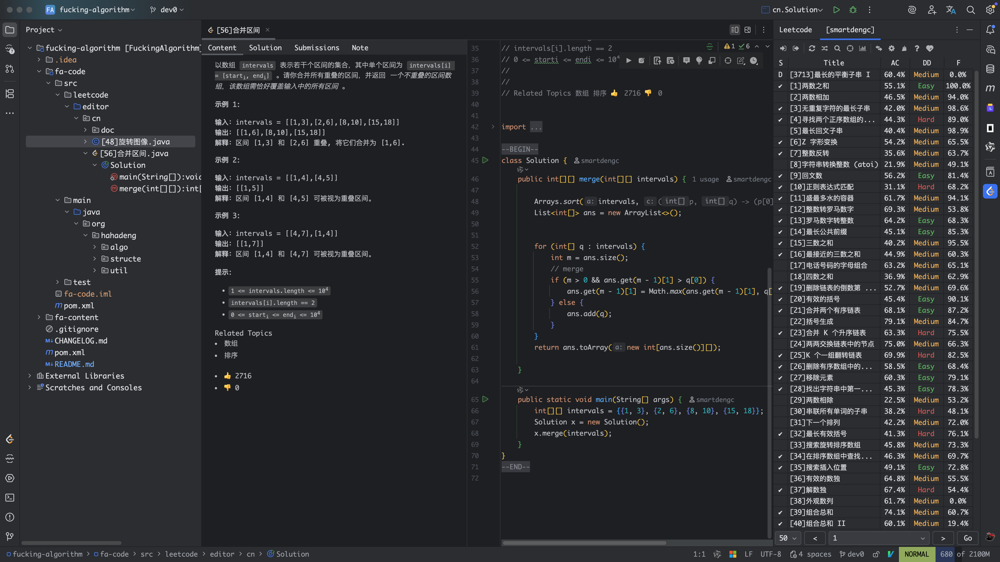

# LeetCode
LeetCode 题解，记录自己的 LeetCode 解题之路。
[灵神-分享｜如何科学刷题？](https://leetcode.cn/discuss/post/3141566/ru-he-ke-xue-shua-ti-by-endlesscheng-q3yd/)  
## 介绍

我发现我不喜欢算法题一个原因是确实太难了，懒懒散散的；
第二个问题就是刷题比较繁琐，在leetcode官方上做题，遇到代码跑不过测试用例的时候，需要在编辑器里面创建java文件，然后把代码拷过来，在自己编写测试用例等等，这些让我一而再再而三的放弃算法的学习；在加上现在大模型的崛起，更加削减了对算法的热情。
现在构建出来自己的刷题流程，持之以恒。

## 工作流
1、使用ide加上leetcode-editor插件，构建出自己熟悉的刷题流程，参考leetcode上大神的配置过程：[技术分享｜IDEA使用LeetCode插件](https://leetcode.cn/discuss/post/3431133/ji-zhu-fen-xiang-ideashi-yong-leetcodech-pzm2/)
简单总结就是，安装leetcode-editor插件，配置插件生成文件的目录， 配置一些不是jdk提供的，但是在leetcode上会出现的类。

2、配合opencode解决看不懂的代码

## 参考
[azl397985856/leetcode](https://github.com/azl397985856/leetcode)

