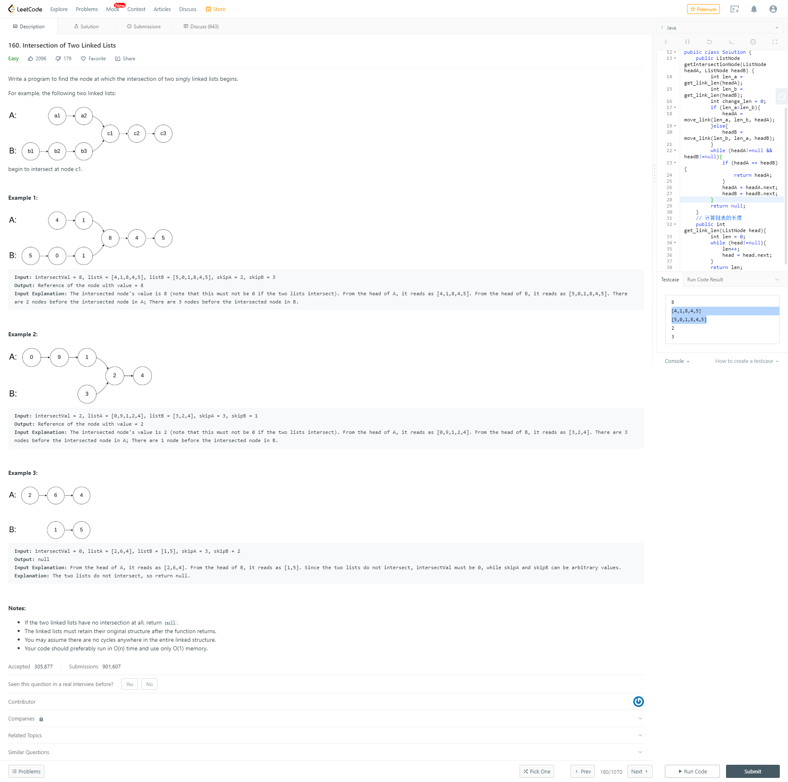
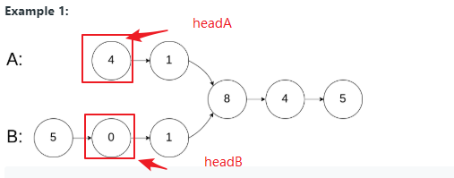

# 题目链接

https://leetcode.com/problems/intersection-of-two-linked-lists/

# 题目描述



# 思路

> 这里分三步  
> 1：计算 两个链表的长度

```
while(head!=null){
    len++;
    head = head.next;
    }
```

> 2：移动长的链表，使得两个链表相互对齐

```
// move_len 表示 两个链表相差的长度

while(head!=null && move_len>0){
    head = head.next;
    move_len--;
}
```


> 3：就是判断 两个链表相交的地方

```$xslt
while(headA!=null && headB != headB){
    if(headA == headB){
        return headA;
    }
    headA = headA.next;
    headB = headB.next;
}
```

# 代码

- java

```java
/**
 * Definition for singly-linked list.
 * public class ListNode {
 *     int val;
 *     ListNode next;
 *     ListNode(int x) {
 *         val = x;
 *         next = null;
 *     }
 * }
 */
public class Solution73 {
    /**
     * 测试：链表添加节点
     * @param head link head
     * @param x node val
     */
     public void addNode(ListNode head,int x){
         if (head==null) {
             return;
         }
         ListNode node = new ListNode(x);
         ListNode nextNode = head ;
         while(nextNode.next!=null){
             nextNode = nextNode.next;
         }
         nextNode.next = node;
     }

    /**
     * init head
     * @param x node val
     * @return ListNode
     */
     public ListNode generatNode(int x) {
         return new ListNode(x);
     }
    /**
     * 计算链表长度
     * @param head ListNode head
     * @return ListNode len
     */
    public int get_link_len(ListNode head){
        int len = 0;
        while (head!=null){
            len++;
            head = head.next;
        }
        return len;
    }
    /**
     * 移动较长链表的头指针
     * @param long_len longer ListNode len
     * @param short_len  shorter ListNode len
     * @param head longer ListNode head
     * @return changed head
     */
    public ListNode move_link(int long_len, int short_len, ListNode head){
        int move_len = long_len - short_len;
        while(head!=null && move_len>0){
            head = head.next;
            move_len--;
        }
        return head;
    }
    /**
     * Find intersection node
     * @param headA headA
     * @param headB headB
     * @return Intersection node
     */
    public ListNode getIntersectionNode(ListNode headA, ListNode headB) {
        int len_a = get_link_len(headA);
        int len_b = get_link_len(headB);
        int change_len = 0;
        if (len_a>len_b){
            headA = move_link(len_a, len_b, headA);
        }else{
            headB = move_link(len_b, len_a, headB);
        }
        while (headA!=null && headB!=null){
            if (headA == headB){
                return headA;
            }
            headA = headA.next;
            headB = headB.next;
        }
        return null;
    }

}
```