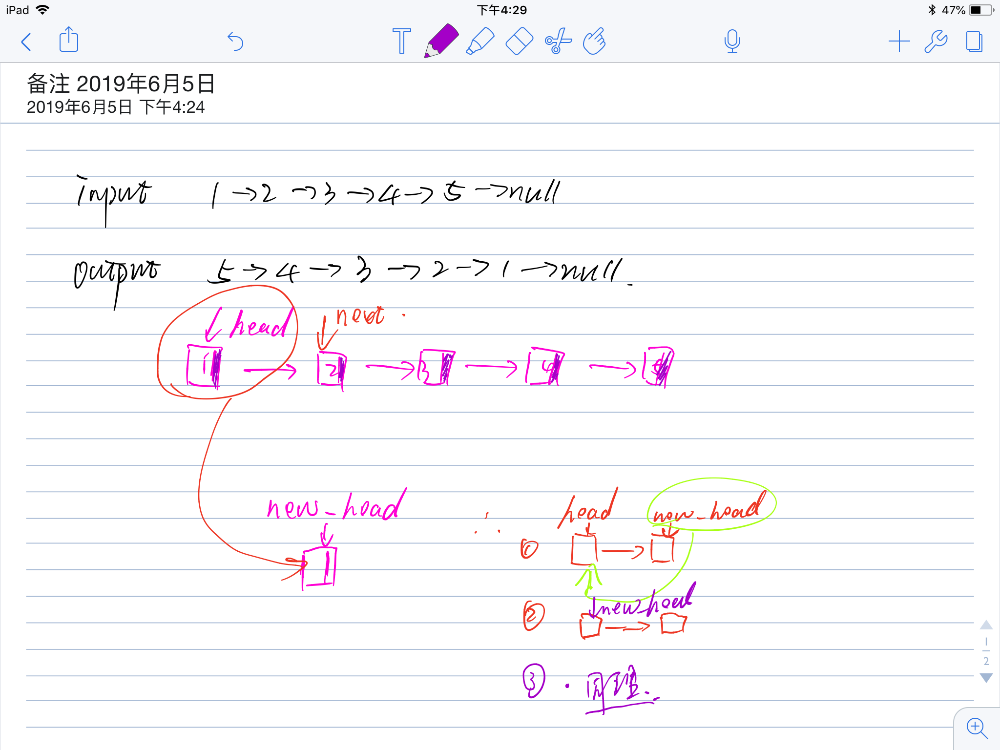

# 题目地址

https://leetcode.com/problems/reverse-linked-list/

# 题目描述

Reverse a singly linked list.

Example:

> Input: 1->2->3->4->5->NULL
> Output: 5->4->3->2->1->NULL

# 思路


1：首先 我们有链表的头部，保存head.next，新建一个new_head的头结点

```
ListNode next = head.next;
ListNode new_head = null;
```

2：将head 链接到new_head 后面

```$xslt
head.next = new_head;
```

3：new_head 指针向前移动

```$xslt
new_head = head;
```

4：head 向后推进一个，循环执行，直到全部逆序完成。

```$xslt
head = head.next;
```

# 代码

- java

```java
/**
 * Definition for singly-linked list.
 * public class ListNode {
 *     int val;
 *     ListNode next;
 *     ListNode(int x) { val = x; }
 * }
 */
class Solution73 {
    public ListNode reverseList(ListNode head){
        ListNode new_head = null;
        while (head != null){    // head!=null,判断当前节点是否为空
            ListNode next = head.next;// 保存head的next
            head.next = new_head;// 将head连接到new_head
            new_head = head;// new_head 移动
            head = next;// head向下移动一个
        }
        return new_head;
    }
}
```